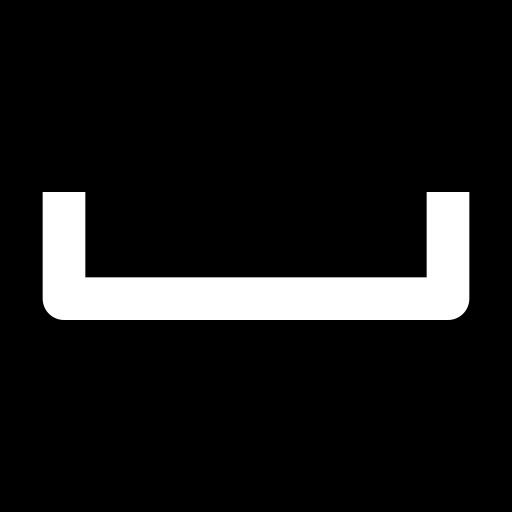

<p align="center">
 
</p>

<h2 align="center">Platform game</h2>

<div align="center">

[]()
[](https://github.com/rabie-snoussi/platform-game/issues)
[](https://github.com/rabie-snoussi/platform-game/pulls)
[](/LICENSE)

</div>

---

## 📝 Table of Contents

- [About](#about)
- [Getting Started](#getting_started)
- [Deployment](#deployment)
- [The Game](#game)
- [Acknowledgments](#acknowledgement)

<br>

## 🧐 About <a name = "about"></a>

A platform game built using **JavaScript, HTML and CSS** without game engine or animation library.

The objective of the game is to complete all levels with the highest number possible of coins.

<br>

## 🏁 Getting Started <a name = "getting_started"></a>

These instructions will get you a copy of the project up and running on your local machine. See [deployment](#deployment) for notes on how to deploy the project on a live system.

### <u>**Prerequisites**</u>

- Node v10+
- Npm v5.6+

<br>

## 🚀 Deployment <a name="deployment"></a>

First, we need to install the dependencies, then we can run the project by the following commands:

```
npm install

npm start
```

The game will be running at: http://localhost:5000/


<sup>_Preview_</sup>

<br>

## 🎮 The Game <a name="game"></a>

### <u>**Controls**</u>

Bellow is the list of keys used to play the game:

| Keys                                                                                                                                                           | Actions                   |
| -------------------------------------------------------------------------------------------------------------------------------------------------------------- | ------------------------- |
|                                                                                    | Movements / Choose option |
|                                                                                | Jump / Select option      |
| <div style="display: flex; justify-content: center;" width=64px height=64px></div> | Pause / Unpause           |

### <u>**Menu**</u>

The menu will have multiple options:

- **Start:** Start the game.
- **Continue:** Continue where you left off.
- **Resume:** Unpause.
- **Restart:** Restart the current level.
- **Music (on/off):** Enable/disable music.
- **SFX (on/off):** Enable/disable sound effects.
- **Grid (on/off):** Show/hide grid.
- **Hurtbox (on/off):** Show/hide hurtboxs.
- **Hitbox (on/off):** Show/hide hitboxs.
- **Quit:** Quit the game.

<br>


<sup>_Menu options_</sup>

### <u>**Collisions**</u>

To detect collisions, we use **4 positions (A, B, C & D)** that will define a shape _(vertices)_.

<br>


<sup>_Block vertices_</sup>

<br>


<sup>_Hero vertices (hurtbox)_</sup>

<br>


<sup>_Hero attack vertices (hitbox)_</sup>

<br>


<sup>_Goblin vertices (hurtbox)_</sup>

<br>


<sup>_Goblin attack vertices (hitbox)_</sup>

We also need a position, that indicates where a certain point will be in the next screen update _(vector)_, it will be used to make the hero move like shown in the picture bellow, the white arrow represents the vector.

<br>


<sup>_Hero moving to the right_</sup>

With vectors, we calculate the future position of hero's hurtbox, if the future position goes inside a block, we detect a collision and the hero won't move further, this way, the hero will never go inside a block, otherwise if there's no blocks, the hero will move freely into that position.

<br>


<sup>_Hero colliding with block_</sup>

<br>


<sup>_Hero running without collisions_</sup>

Attacks work almost the same but without vectors, we check instead, if the hitbox goes inside enemy's hurtbox, that's when we detect a collision.

<br>


<sup>_Hero attacking_</sup>

<br>


<sup>_Gobling attacking_</sup>

### <u>**Gravity**</u>

Gravity in game works with acceleration like in real life, while the hero is in the air, we apply an incremental force that will pull him down harder each time untill he touches the ground.

<br>


<sup>_Gravity_</sup>

### <u>**Save**</u>

The progress of the game and it's settings will be saved in localeStorage, this way the user can continue to play from where he left off, the data will be encrypted to prevent users from cheating.

<br>


<sup>_LocalStorage_</sup>

<br>

## 🎉 Acknowledgements <a name = "acknowledgement"></a>

Special thanks to everyone who provided assets to make this possible, namely:

- [O_lobster](https://twitter.com/sir_shazam) (2D arts).
- [Avgvsta](https://opengameart.org/users/avgvsta) (Music).
- [Artisticdude](https://opengameart.org/users/artisticdude) (Sound effects).
- [Juhani Junkala](https://juhanijunkala.com/) (Sound effects).
- [@Shades](https://soundcloud.com/noshades) (Sound effects).
